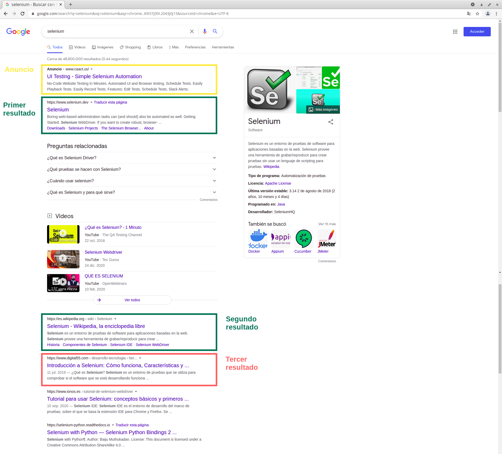
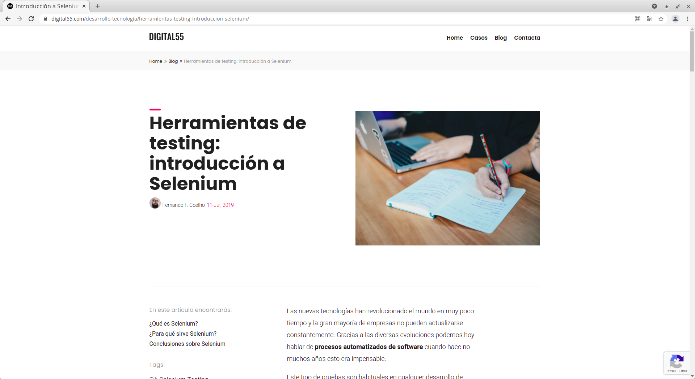

# Trabajo Práctico Nº4

Autor:

* Agustín Curcio Berardi

Docente:

* Carlos Pantelides

## Consignas

### Práctica Webdriver

Hacer funcionar webdriver con el navegador Chrome tal que busque en Google una palabra y vaya al tercer resultado no patrocinado.

Se solicita entregar:
- Documento con evidencia

---

## Solución propuesta

En la resolución propuesta, se parte del  y se lo modificó levemente para que en lugar de buscar un elemento de texto se localizara el tercer resultado de búsqueda utilizando el selector del tipo .

Si se analiza el HTML que genera una búsqueda de Google, se verificará que los resultados no patronicados se muestran a través de `div` de las clases `hlcw0c` o `g`. Así, del listado de `div` que devuelve la búsqueda se selecciona el tercer resultado y se lo accede con el método `.click()`.

En la siguiente imagen se muestran los resultados de búsqueda de la palabara "Selenium".

     
    <b>Figura 1</b>. Resultados de búsqueda de la palabra "Selenium".

Como se puede apreciar en la figura anterior, el tercer resultado resaltado en color rojo corresponde a la página con título **"Herramientas de testing: introducción a Selenium"** en el sitio ![Digital55].(https://www.digital55.com/desarrollo-tecnologia/herramientas-testing-introduccion-selenium/). Este sitio se muestra en la Figura 2.

     
    <b>Figura 2</b>. Sitio web correspondiente con el tercer resultado de búsqueda.

Finalmente, en la siguiente animación se muestra como se abre dicho sitio web utilizando el caso de prueba junto con Selenium.

     
    <b>Figura 3</b>. Acceso al tercer resultado de búsqueda utilizando Selenium.

Mientras que el resultado que se obtuvo en la consola es el siguiente:

    agustin@laptop:~$ npm test

    > tp4@1.0.0 test /home/agustin/MIoT/TSIoT/tp4
    > mocha --reporter spec

    Prueba que accede al tercer vínculo no patrocinado de una búsqueda en Google.
        ✔ Se busca el término "Selenium". (9346ms)

    1 passing (9s)

---

